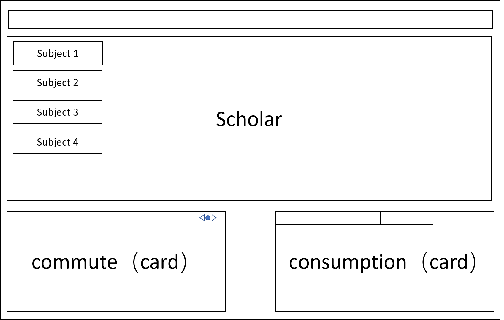

<head> 
     
     
</head> 
<link rel="stylesheet" href="https://use.fontawesome.com/releases/v5.0.0/css/all.css">

# SummerIsComing

## System Infrastructure

### Student Scope

## Schedule

- 4.20 学生域完成  
-  4.28 课程域完成   
- 5.4 全部完成 

## Todo List

4.12 calendar 的绘制，支持对给定学生通勤情况查询 &nbsp; <i class="fas fa-check"></i>

4.14 各科成绩图的绘制 ——by Meng Linhao
